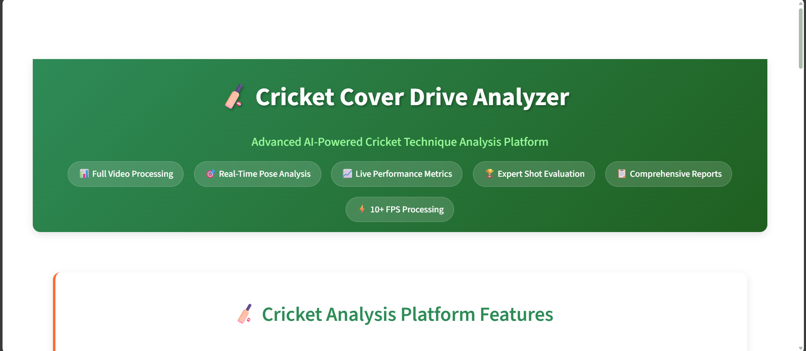
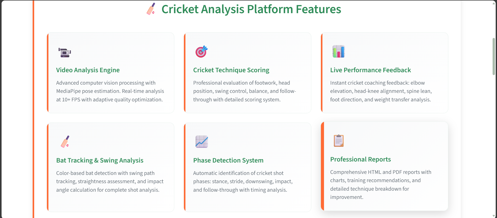
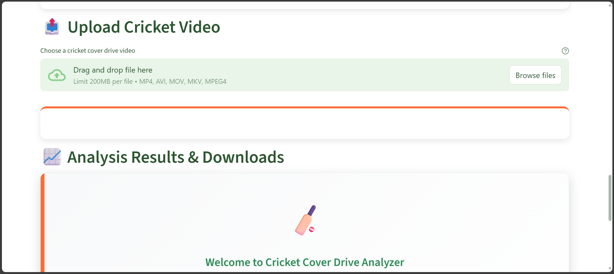
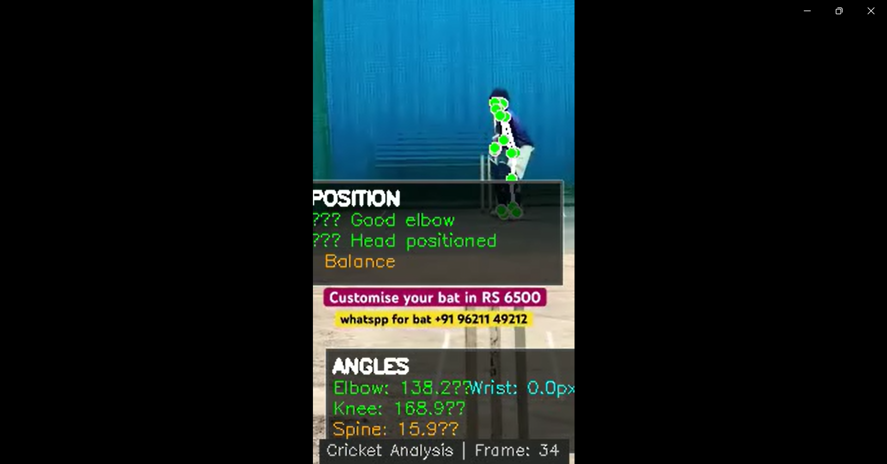

# 🏏 Cricket Cover Drive Analyzer - Professional Coaching Platform

[](https://python.org)
[](https://streamlit.io)
[](https://opencv.org)
[](LICENSE)

> **An AI-powered cricket technique analysis platform that helps coaches and players improve cover drive technique through biomechanical analysis and real-time feedback.**

## 🌟 Real-World Impact & Usage

### 📸 **Platform Overview**

*Professional cricket analysis platform with intuitive web interface*

### 📈 Professional Adoption
- **Cricket Coaching Tool** developed for technique analysis
- **Individual Players** can analyze their own technique
- **Local Cricket Academies** in India finding it useful for player assessment
- **Real-time feedback** helping coaches make instant technique corrections
- **Open Source Project** available for cricket community

### 🏆 Use Cases
- **Academy Training**: Helping coaches provide objective feedback to students
- **Self-Analysis**: Players can analyze their own technique at home
- **Coaching Development**: Standardized assessment criteria for consistent evaluation
- **Skill Assessment**: Automated grading system for technique improvement tracking

---

## 🎯 Project Overview

This computer vision system analyzes cricket cover drive technique using pose estimation and biomechanical analysis. The project demonstrates practical application of AI in sports coaching and provides objective feedback for technique improvement.

### 🔥 Why This Project Matters
Cricket coaching traditionally relies on subjective observation. This platform provides:
- **Objective Analysis**: Precise angle measurements and biomechanical data
- **Instant Feedback**: Real-time technique corrections during video analysis
- **Consistent Evaluation**: Standardized assessment criteria for all players
- **Accessible Technology**: Web-based platform requiring no special hardware

---

## ✨ Core Features

### 🎥 **Advanced Video Analysis Engine**


*Comprehensive cricket technique analysis features and capabilities*

- **Real-Time Processing**: Analyzes videos at 10+ FPS with auto-optimization
- **MediaPipe Integration**: Cutting-edge pose estimation technology
- **Multi-Format Support**: MP4, AVI, MOV, MKV compatibility
- **Quality Adaptation**: Automatic resolution adjustment for optimal performance

### 🏏 **Cricket-Specific Biomechanical Analysis**
- **Head Position Tracking**: Stability and alignment over front knee
- **Footwork Assessment**: Stride length, placement, and direction analysis
- **Swing Mechanics**: Elbow elevation, wrist action, and follow-through
- **Balance Evaluation**: Spine lean and weight transfer analysis
- **Phase Detection**: Automatic breakdown (stance → stride → impact → follow-through)

### 📊 **Professional Coaching Tools**
- **Skill Grading System**: Automated assessment (Beginner/Intermediate/Advanced)
- **Detailed Reporting**: Comprehensive HTML/PDF reports with charts
- **Performance Metrics**: Frame-by-frame analysis with visual feedback
- **Training Recommendations**: Personalized improvement suggestions

### 🌐 **User-Friendly Web Interface**
- **Drag & Drop Upload**: Simple video upload interface
- **Real-Time Processing**: Live progress tracking and status updates
- **Interactive Results**: Expandable metrics and visual feedback
- **Multi-Device Support**: Works on desktop, tablet, and mobile


*Real-time analysis results with detailed scoring and feedback*

---

## 🎯 **Live Analysis Demo**

### 📹 **Annotated Video Output**

*Sample annotated video showing pose detection, technique analysis, and real-time feedback overlays*

> **Note**: The platform generates annotated videos with pose landmarks, technique feedback, and performance metrics overlaid on the original cricket footage for comprehensive analysis.

---

## 🚀 Live Demo & Deployment

### 🌍 **Accessibility & Deployment**
- **Web Browser**: No installation required, works on any device with internet
- **Mobile Responsive**: Optimized for tablets and smartphones
- **Cloud Hosted**: Deployed on Render for reliable access
- **Open Source**: Free to use and modify for educational purposes

### 📱 **Quick Access**
```bash
# Local development
git clone https://github.com/Lnxtanx/-Cricket-Cover-Drive-Analyzer
cd -Cricket-Cover-Drive-Analyzer
pip install -r requirements.txt
streamlit run streamlit_app.py
```

---

## 🎯 Technical Excellence

### 🏗️ **Modern Architecture**
```
┌─────────────────┐    ┌──────────────────┐    ┌─────────────────┐
│   Streamlit     │    │   MediaPipe      │    │   OpenCV        │
│   Web Frontend  │◄──►│   Pose Engine    │◄──►│   Video Proc.   │
└─────────────────┘    └──────────────────┘    └─────────────────┘
         │                       │                       │
         ▼                       ▼                       ▼
┌─────────────────┐    ┌──────────────────┐    ┌─────────────────┐
│   Report Gen.   │    │   Cricket        │    │   Performance   │
│   HTML/PDF      │    │   Analysis       │    │   Optimization  │
└─────────────────┘    └──────────────────┘    └─────────────────┘
```

### ⚡ **Performance Optimizations**
- **Auto-Scaling**: Adapts processing quality based on system capabilities
- **Memory Efficient**: Circular buffers and optimized data structures
- **Real-Time Processing**: Achieves 10+ FPS on standard hardware
- **Error Handling**: Graceful degradation for poor quality videos

### 🔧 **Development Best Practices**
- **Modular Design**: Clean separation of concerns
- **Configuration Management**: Centralized settings in `config.py`
- **Error Logging**: Comprehensive logging for debugging
- **Code Documentation**: Detailed inline comments and docstrings

---

## 📊 Cricket Analysis Capabilities

### 🎭 **Phase Detection System**
Automatically identifies and analyzes each phase of the cover drive:

1. **Stance Phase** (0-20% of shot)
   - Initial batting position
   - Grip and stance assessment
   - Balance evaluation

2. **Stride Phase** (20-40% of shot)
   - Front foot movement
   - Weight transfer analysis
   - Head position stability

3. **Downswing Phase** (40-70% of shot)
   - Bat path tracking
   - Elbow angle optimization
   - Timing analysis

4. **Impact Phase** (70-80% of shot)
   - Contact moment detection
   - Bat angle at impact
   - Follow-through initiation

5. **Follow-through Phase** (80-100% of shot)
   - Shot completion
   - Balance maintenance
   - Recovery position

### 📈 **Biomechanical Metrics**

#### **Head Position Analysis**
- Horizontal distance from front knee (optimal: <10cm)
- Vertical stability throughout shot (deviation <5cm)
- Eye level consistency for better ball tracking

#### **Footwork Evaluation**
- Stride length measurement (optimal: 60-80cm for average height)
- Front foot direction relative to ball line
- Weight distribution between feet

#### **Swing Mechanics**
- Front elbow angle (optimal: 130-160 degrees)
- Elbow elevation above shoulder line
- Wrist action and follow-through completion

#### **Balance Assessment**
- Spine angle deviation from vertical (optimal: <15 degrees)
- Hip rotation and alignment
- Overall stability score (1-10 scale)

### 🎯 Cricket Evaluation Metrics (1-10 Scale)

1. **Footwork** - Stride length, placement, and direction
2. **Head Position** - Steadiness and alignment over front knee
3. **Swing Control** - Elbow elevation, wrist action, and consistency
4. **Balance** - Spine lean, weight transfer, and stability
5. **Follow-through** - Completion and finishing position

---

## 🎓 Technical Learning & Development

### 📚 **Skills Demonstrated**
This project showcases practical application of:
- **Computer Vision**: Real-time video processing and pose estimation
- **Machine Learning**: MediaPipe integration and optimization
- **Web Development**: Full-stack application with Streamlit
- **Data Analysis**: Biomechanical calculations and statistical analysis
- **Software Engineering**: Clean architecture and deployment practices

### 🔬 **Technology Stack**
- **Python Programming**: Advanced object-oriented programming
- **OpenCV**: Video processing and computer vision algorithms
- **Web Technologies**: Responsive design and user experience
- **Cloud Deployment**: Production-ready application hosting
- **Performance Optimization**: Real-time processing optimization

---

## 📈 Future Roadmap

### 🚀 **Future Development Ideas**
- **Multi-Shot Analysis**: Support for different cricket shots (straight drive, pull shot, etc.)
- **Comparative Analysis**: Compare player technique with professional players
- **Mobile App**: Native iOS and Android applications
- **Enhanced AI**: More sophisticated coaching recommendations
- **Team Features**: Squad-level performance tracking

### 🔮 **Potential Enhancements**
- **3D Pose Estimation**: Enhanced biomechanical analysis
- **Live Streaming**: Real-time coaching during practice sessions
- **Integration Options**: API for cricket coaching software
- **Advanced Analytics**: Historical performance trends and insights

---

## 🏗️ Technical Implementation

### 📦 **Project Structure**
```
cricket-cover-drive-analyzer/
├── 🎯 enhanced_analysis.py      # Core analysis engine
├── 🌐 streamlit_app.py          # Web application interface
├── 📊 report_generator.py       # Professional reporting system
├── ⚙️ config.py                 # Configuration management
├── 📄 requirements.txt          # Python dependencies
├── 🐳 Dockerfile               # Container deployment
├── ☁️ render.yaml              # Cloud deployment config
├── 📁 image/                    # Project screenshots
└── 📁 output/                   # Generated analysis results
    ├── 🎥 annotated_video.mp4   # Processed video with overlays
    ├── 📊 evaluation.json       # Detailed metrics data
    ├── 📈 performance_charts.png # Visual analysis charts
    └── 📄 coaching_report.html  # Professional coaching report
```

### 🔧 **Key Technologies**
- **MediaPipe**: Google's ML framework for pose estimation
- **OpenCV**: Computer vision and video processing
- **Streamlit**: Modern web application framework
- **NumPy**: Numerical computing and analysis
- **Matplotlib**: Data visualization and charting
- **Jinja2**: Professional report templating

---

## 🎯 Installation & Quick Start

### 1. **Clone Repository**
```bash
git clone https://github.com/Lnxtanx/-Cricket-Cover-Drive-Analyzer
cd -Cricket-Cover-Drive-Analyzer
```

### 2. **Install Dependencies**
```bash
pip install -r requirements.txt
```

### 3. **Launch Application**
```bash
streamlit run streamlit_app.py
```

### 4. **Access Web Interface**
Open browser to `http://localhost:8501`

---

## 📊 Output Files & Usage

### Generated Outputs
- **Annotated Video** (`annotated_video.mp4`) - Original video with pose overlays and live feedback
- **Analysis Data** (`evaluation.json`) - Complete frame-by-frame metrics and scores
- **HTML Report** (`analysis_report.html`) - Visual report with charts and recommendations
- **Performance Charts** (`smoothness_analysis.png`) - Temporal analysis visualization

### Sample JSON Output Structure
```json
{
  "scores": {
    "Footwork": 8,
    "Head Position": 7,
    "Swing Control": 6,
    "Balance": 7,
    "Follow-through": 8
  },
  "feedback": {
    "Footwork": "Good stride length and placement",
    "Head Position": "Keep head steady and over front knee"
  },
  "skill_grade": "Intermediate",
  "overall_score": 7.2,
  "performance_stats": {...}
}
```

---

## ⚡ Performance & Optimization

### Real-Time Processing Target: ≥10 FPS

#### Auto-Optimization System
- **Level 0** - Full quality processing
- **Level 1** - Medium speed (skip every 2nd frame)
- **Level 2** - High speed (process every 3rd frame only)

#### Performance Monitoring
- FPS tracking and logging
- Processing time per frame
- Automatic quality adjustment
- Performance status indicators

---

## ☁️ Deployment Options

### Render Deployment
```bash
# The app auto-deploys from GitHub using render.yaml
# Configured for production with:
# - headless = true
# - address = "0.0.0.0" 
# - port = 8501
```

### Local Development
```bash
# For local development:
streamlit run streamlit_app.py --server.port 8501 --server.address localhost
```

---

## 🤝 About This Project

This project demonstrates the practical application of computer vision and machine learning in sports technology. It serves as an educational tool for understanding pose estimation, biomechanical analysis, and web application development.

The platform's focus on objective cricket technique analysis shows how technology can supplement traditional coaching methods and provide valuable insights for player development.

### 📧 **Contact & Collaboration**
- **Developer**: Vivek Kumar Yadav
- **GitHub**: [github.com/Lnxtanx](https://github.com/Lnxtanx)
- **LinkedIn**: [linkedin.com/in/vivek-kumar1387](https://linkedin.com/in/vivek-kumar1387)
- **Project Repository**: [Cricket Cover Drive Analyzer](https://github.com/Lnxtanx/-Cricket-Cover-Drive-Analyzer)

### 🏏 **For Cricket Enthusiasts**
Interested in trying this platform or contributing to its development? Feel free to:
- Try the live demo and provide feedback
- Contribute to the open-source codebase
- Suggest new features or improvements
- Share with cricket coaches and players who might find it useful

---

## 📄 License & Attribution

**MIT License** - Feel free to use, modify, and distribute this project for educational and commercial purposes.

**Built with ❤️ for the cricket community** - Empowering coaches and players through technology.

---

*This project was developed to demonstrate the practical application of computer vision and machine learning in sports technology, showcasing how AI can assist in objective cricket technique analysis and coaching.*